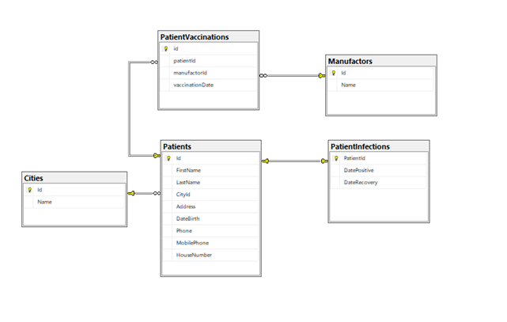

Project architect document

The frontend UI layer is a HTML page with css and Javascript. It runs on a web server (visual studio debug web server). This layer access the backend layer in http protocol using javascript fetch method. It uses Post for updates and Get for data query.

The backend WebAPI layer uses .net c# web api project, it is in the same project as the UI and uses the same web server as the UI layer.

The backend has three layers: API, Buiseness Layer, Data Layer.

API – c# web api controllers, gets Post with json objects for updating, get with no id for data retriving for all list, and get with id to get data by id.

This layer return ActionResult with the data, or with error message if fails.

BL – c# classes, gets data for the api, responsible for validation and accessing the data layer. Returns a typed Result object with the status and the data, if there is an error return the error message.

This layer has a global Validator class.

DL – Gets calls from the BL. Accesses the data base with Entity Framework. Returns the results of the data. Uses the Models classes that in the DB. 

The model class have validations attributes, so when trying to update with not valid data update vails.

Data Base – sql server. 

The schema diagram is attached:

