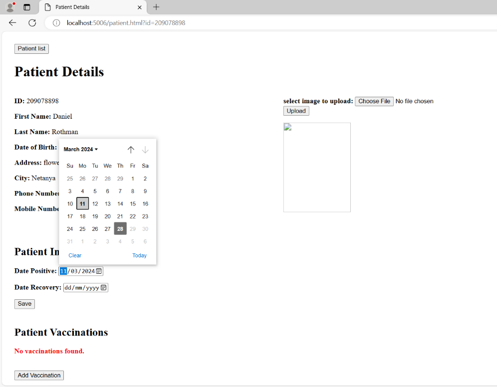

CoronaAPI

Description

CoronaAPI is a system comprising server-side and client-side components, as well as a database, for managing a COVID repository for a large healthcare fund. The system displays members of the healthcare fund and manages the income records in the database. Additionally, the system stores key details regarding the COVID pandemic in the context of the healthcare fund's members.

The exercise consists of two main parts: 1. Development of server-side, client-side, and bonus questions, and 2. Quality strategy (part2).

Usage

1.	Run the program.
The URL address is: localhost:5006/patients.html
You will see a window containing the list of patients registered in the HMO:

2.	To add a new patient to health fund, click "Add Patient".
A new window will appear where you can enter patient information.
Pay attention to enter correct details because there are input correctness checks on both client and server.

 
To save the new patient's information, click ""Add".
You can exit the "Add Patient" window without saving details by clicking the X on the top right of the popup window or by clicking "Cancel" at the bottom of the window. 

3.	To view the patient's details and add details regarding the corona virus, click on the icon to the left of his ID card.

All the patient's personal details appear under the heading "Patient Details".

4.	Under the heading "Patient Infections" you can add details about when the patient contracted the virus and when he was cured.

To save the details, click "Save".

The dates can be updated following a new infection. In such a case it is necessary to update Date Recovery to a date later than the Date Positive update date or to update Date Recovery to NULL by clicking "Clear" in the date box.

5.	Under the heading Patient Vaccinations you can add information about vaccinations the patient received.
To add vaccination details, click on "Add Vaccination".
A new window will appear where you can fill in vaccine details: date of receiving the vaccine and manufacturing company.

After selecting the details, click on "Add Vaccination" for the details to be saved.
You can exit the "Add Patient Vaccination" window without saving details by clicking the X on the top right of the popup window or by clicking "Cancel" at the bottom of the window.

After adding vaccination details, the details will appear in the table under the heading "Patient Vaccinations".

After adding the first vaccination details to the patient, the patient was removed from the number of people who were not vaccinated at all and therefore their number dropped by one.

6.	You can add a picture to the patient by clicking on "Choose File" on the right and selecting a picture. 

To save the image, click on "Upload". The image will appear to the right of the patient's details.

You can return from the "Patient Details" window to the main window by clicking on "Patient list" on the top left.

Installation
External dependencies:
sql server database -
You can download at: 
https://www.microsoft.com/en-us/sql-server/sql-server-downloads
Visual Studio's built-in web server -
You can download at: 
https://visualstudio.microsoft.com/downloads/

Establishing the project:
Creating the database using the script file attached in the track: 
hadasim-4/CoronaAPI/script.sql
The project must be opened using visual studio and run using run
Then surf in the browser to the page http://localhost:5006/patients.html

Discounts make it easier
-You can get a vaccine during illness.
-You can add a vaccine with an earlier date than an existing vaccine in the system.

